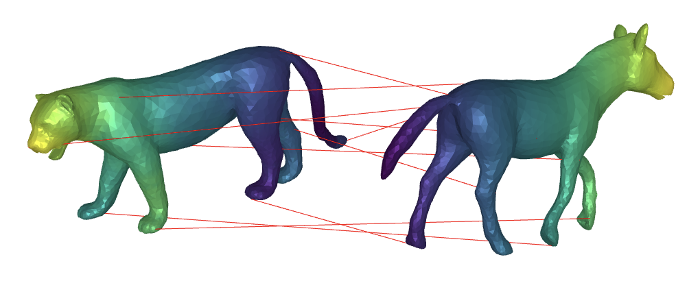

# Complex Functional Maps: a Conformal Link between Tangent Bundles

This repository contains Python implementation for complex functional maps and additionally provides code to reproduce the main figures of the paper

> **Complex Functional Maps**<br/>
> Nicolas Donati, Etienne Corman, Simone Melzi, Maks Ovsjanikov<br/>
> In *CGF 2022*<br/>
<!--
> [PDF](),
> [Video](https://www.youtube.com/watch?v=U6wtw6W4x3I),
> [Project page](http://igl.ethz.ch/projects/instant-meshes/)
-->


<p align="center">

</p>

## Use Complex Functional Maps
All the necessary code for complex functional maps is in the ``Tools/`` folder. Apart from the standard libraries (numpy, scipy), you will need python bindings for ``libigl``, which can be installed for instance with:

    conda install -c conda-forge igl

Also, to run some of the scripts we provide to reproduce some of the figures and tables of the paper, you will need meshplot, which can also be fetched with conda:

    conda install -c conda-forge meshplot

With meshplot one can directly display shapes interactively for instance in a Jupyter cell, as shown in the next images below, where we represent a vector field transfer and a map obtained with our method.

<p align="center">


</p>

We provide jupyter notebooks and their corresponding python scripts to show how to use complex functional maps in the scenarii we propose in the paper. To that end, we provide FAUST re-meshed and SMAL re-meshed datasets in the ``data/`` folder.

Namely, we show:
* how to perform vector field transfer using complex functional maps, and a visualization of the transfer.
  * in ``VF_transfer.ipynb`` we load two shapes of the FAUST re-meshed dataset, get an accurate complex functional map using a reduced ground-truth functional map and transfer vector fields in a low spectral basis.
  * in ``VF_table.ipynb`` we provide a script to compare our vector field transfer to that of Wang et al. and Azencot et al., as desribed in the paper.
* how to use bijective Zoomout with discrete Optimisation (from Ren et al., SGP 2021) with our complex functional maps modification.
  * in ``SMAL_example.ipynb`` we load two shapes of the SMAL re-meshed dataset and compute maps between them using these different Zoomout (complex or not) algoritms.
  * in ``SMAL_table.ipynb`` we report the script used to get Table 3 (and Figure 9) of the paper.

## Citation
If you use our work, please cite our paper.
```
@article{donati2022CFMaps,
  title={Complex Functional Maps: a Conformal Link between Tangent Bundles},
  author={Donati, Nicolas and Corman, Etienne and Melzi, Simone and Ovsjanikov, Maks},
  journal={CGF},
  year={2022}
}
```

## Contact
If you have any problem about this implementation, please feel free to contact via:

nicolas DOT donati AT polytechnique DOT edu